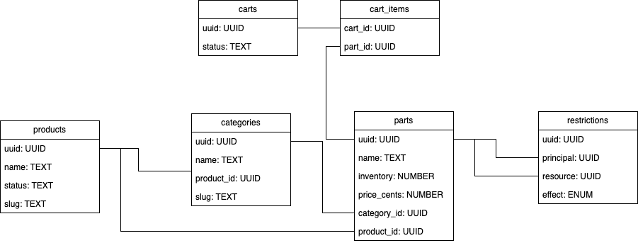

# What data model would best support this application? 
A relational data model supports our application the best here are my reasons why.
* Data is in structured relationships of products -> building categories -> parts
  * This is a straightforward ontological model we can see in the database tables
  * Future extensibility is also easy
* Our data model can quickly provide independent insights into what is possible with our application
  * We benefit from important data rules and their protections built in to the database
* We have data integrity with our model
  * For example using our foreign keys, we can't end up with weird combinations e.g. rim colours on skiis
* UUIDs in the database schema also allows us to leverage micro-services in the future
* Though not implemented, I believe soft deletion columns would be desireable

For completeness' sake I would also like to point out the cons of this approach.
* Large scale performance can take a hit
  * Say we wanted to have millions of products being produced. The fact that we need to use joins can hurt
* Increasingly complex extensibility.
  * The challenge mentions there being extensibility to the products list in the future, but assuming an extreme case
  * where there are really a lot of evolving product definitions. The rigidness of the relational approach would not be ideal
* 

# Can you describe it? Include table specifications (or documents if it's a non-relational database) with fields, their associations, and the meaning of each entity.
This is a quick tables schema that I have drawn up, you can find it's creations in the migrations folder of the backend.

This schema consists of 
1. Products Table (products) - Represents the broad product lines like bikes, skis, surfboards. Each product has:
   1. uuid as a primary key
   2. a slug clean URLs and lookups
   3. name a human readable version of the name
      1. This should be a key or using the slug to look up for a translation string to consider internationalization
   4. status of whether this product is available
      1. This is useful to be able to tell the user if this feature is available already. not quite feature flags but comparable
   5. optional location (e.g., image or asset path)
      1. This contains some of the metadata for our product in our case it's just a quick and useful way to get the images I want to render in the front-end

2. Categories Table (categories) - Groups configurable aspects of a product.Each category is linked to a specific product via product_id (foreign key).
   1. Name must be unique per product, allowing "Frame Type" to exist once per product.
   2. This allows us to essentially have different build steps for our products in a flexible way

3. Parts Table (parts) - Represents the actual parts users can choose from inside a category.
   1. Each part belongs to a category
   2. Parts store inventory and the price for e-commerce integrity
      1. The price is stored in ints to avoid float maths and falling prey to leaky abstractions this is then mitigated in the front-end. For example, 60.99 is saved as 6099.
   3. Part names are unique within their category

4. Restrictions Table (restrictions) - Defines compatibility rules between parts. This is done in a "permissions style" whereby one has a "principal" and a "resource" upon which the restriction is describing. The effect is describing the relationship between the principal and the resource:
   1. The effect field allows for 3 settings:
      1. "allow" = describes the resource available to the principal
      2. "forbid" = disables the resource to the principal
      3. "only" = exclusive restriction meaning this is the only option allowed for the resource by the principal
